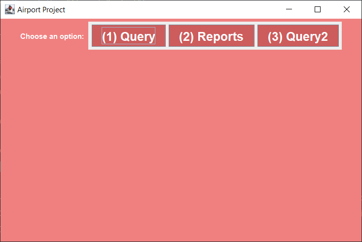

# Airport Project

The project consist to make a parsing for 3 CSV files.  
The files contain data for countries, airports and runway information.  
The code is fully-made in functionnal scala without using «var», «for», «return», «.get», «null», «throw» keywords.  
Master 1 project made for the Functional Programming with Scala cursus at Efrei Paris.  
Made with Sivananthan Sarankan.  

Main GUI Interface :

The application proposed 2 options :
1. Query Option ask the user for the country name or code and display the airports & runways at each airport. The input can be country code or country name.

Query GUI Interface :

2. Choosing Reports display the following (possibly through a menu):  
  • 10 countries with highest number of airports (with count) and countries  with lowest number of airports.  
  • Type of runways (as indicated in "surface" column) per country.  
  • The top 10 most common runway latitude (indicated in "le_ident" column).  

Reports GUI Interface :

We also implemented additionals functionalities :
* Name matching partial/fuzzy. e.g. entering zimb will result in Zimbabwe.  
* Using a database for our requests (sqlite).  
* Develop a GUI Interface.  
